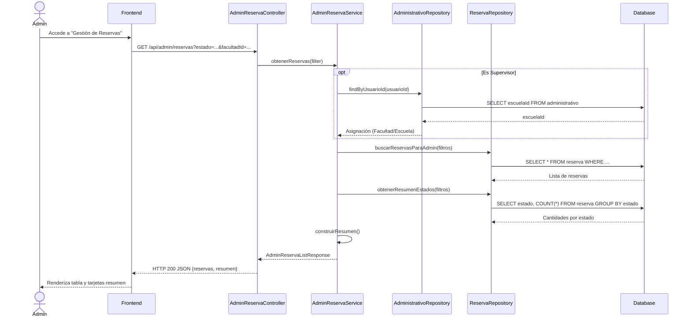
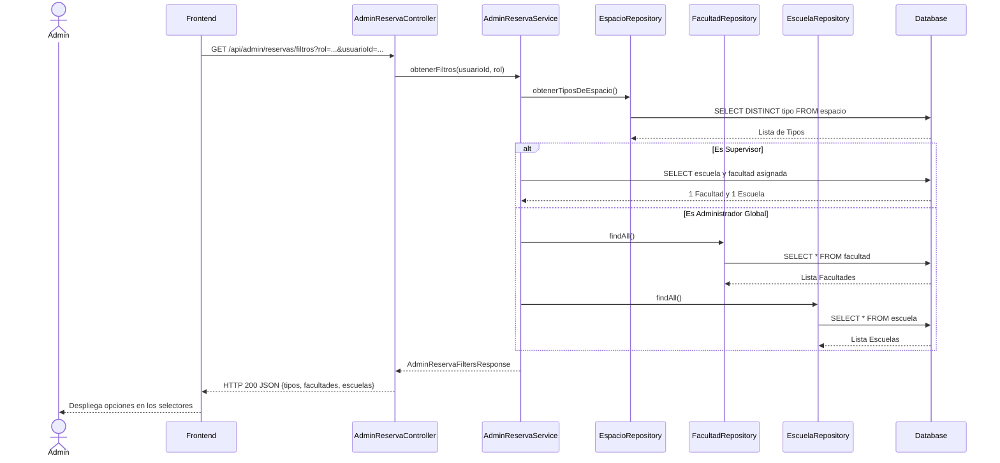
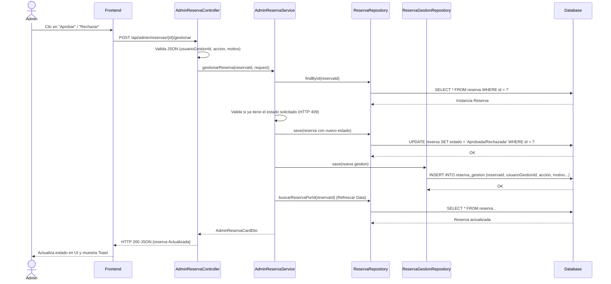

# Servicio de Administración de Reservas (servicio-adreserva)

## Descripción
Este microservicio está diseñado para que los usuarios con rol de Administrador o Supervisor puedan listar, filtrar y gestionar (Aprobar/Rechazar) las reservas de espacios (aulas, laboratorios, canchas, etc.) realizadas por estudiantes o docentes.

## Arquitectura
- **Frontend:** React (Componentes en `GestionAdmin/GestionReservas`, Llamadas HTTP vía Axios o Fetch).
- **Backend:** PHP puro (Mini-framework propio con `App\Core\Router`), puerto de servicio.
- **Base de Datos:** MySQL (Tablas: `reserva`, `reserva_gestion`, `facultad`, `escuela`, `espacio`, `administrativo`).

---

## 1. Función: Listar Reservas

### Descripción
Obtiene un listado paginado o filtrado de todas las reservas y un resumen estadístico (Pendiente, Aprobada, Rechazada, Cancelada). Si el usuario es un "Supervisor", automáticamente se filtran los resultados a la facultad y escuela a la que pertenece.

### Diagrama Mermaid

---

## 2. Función: Obtener Filtros

### Descripción
Devuelve las opciones disponibles para poblar los selects (comboboxes) en la interfaz de usuario, como los tipos de espacio, facultades y escuelas. Si el usuario es "Supervisor", solo devuelve su propia facultad y escuela.

### Diagrama Mermaid

---

## 3. Función: Gestionar Reserva (Aprobar / Rechazar)

### Descripción
Permite a un administrador o supervisor evaluar una reserva "Pendiente". El administrador ingresa un motivo y opcionalmente comentarios, determinando si la reserva pasa a estado "Aprobada" o "Rechazada".

### Diagrama Mermaid

