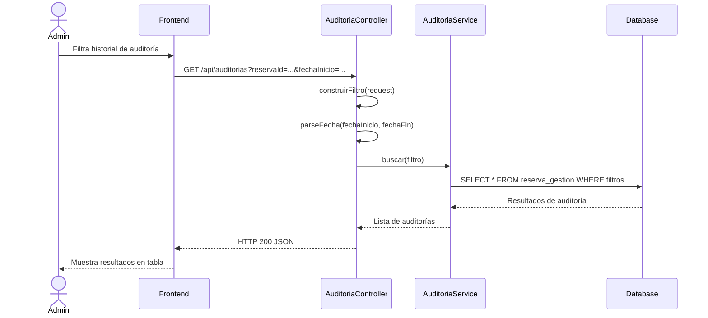
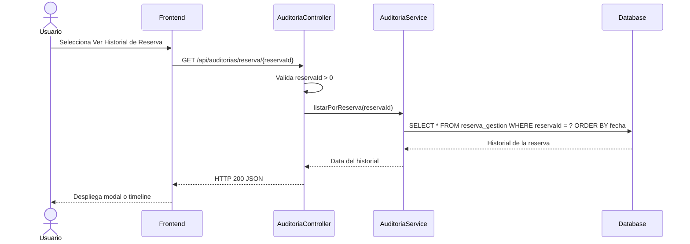
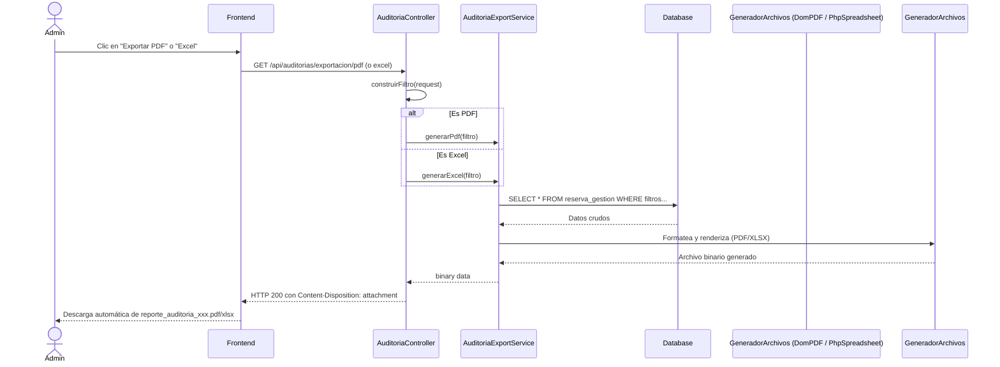

# Servicio de Auditoría (servicio-auditoria)

## Descripción
Este microservicio se encarga de rastrear y proporcionar el historial de cambios, gestiones y estados de las reservas de la plataforma. Permite visualizar qué usuario realizó una acción, cuándo la hizo y exportar estos reportes a formatos PDF y Excel.

## Arquitectura
- **Frontend:** React (Llamadas HTTP a la API de auditorías para poblar tablas y descargar reportes).
- **Backend:** Laravel (Expone endpoints REST en `AuditoriaController`, con la lógica encapsulada en `AuditoriaService` y `AuditoriaExportService`).
- **Base de Datos:** MySQL (Probablemente consulta las tablas de log como `reserva_gestion` y `reserva`).

---

## 1. Función: Listar y Filtrar Auditorías

### Descripción
Recupera el historial de auditoría basado en filtros como el ID de la reserva, estado, usuario y un rango de fechas.

### Diagrama Mermaid

---

## 2. Función: Detalle de Auditoría e Historial por Reserva

### Descripción
Obtiene el detalle específico de un registro de auditoría (`/auditorias/{id}`) o el historial completo de gestiones para una reserva específica (`/auditorias/reserva/{reservaId}`).

### Diagrama Mermaid

---

## 3. Función: Exportar Auditoría (PDF / Excel)

### Descripción
Genera un archivo binario descargable (PDF o Excel) con los registros de auditoría aplicando los filtros seleccionados por el usuario.

### Diagrama Mermaid

