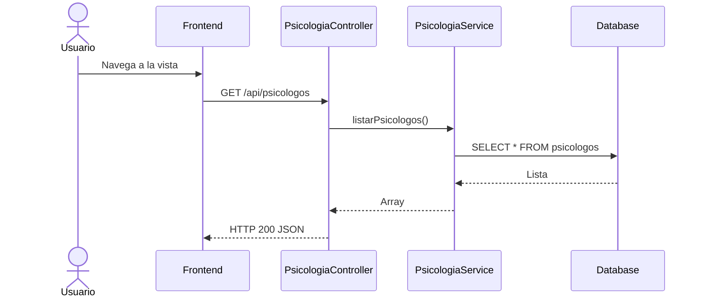
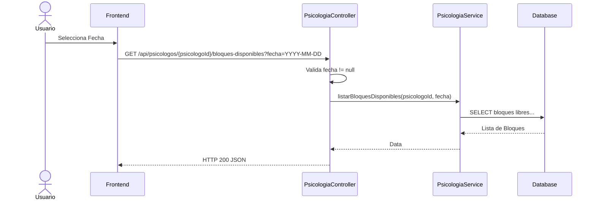
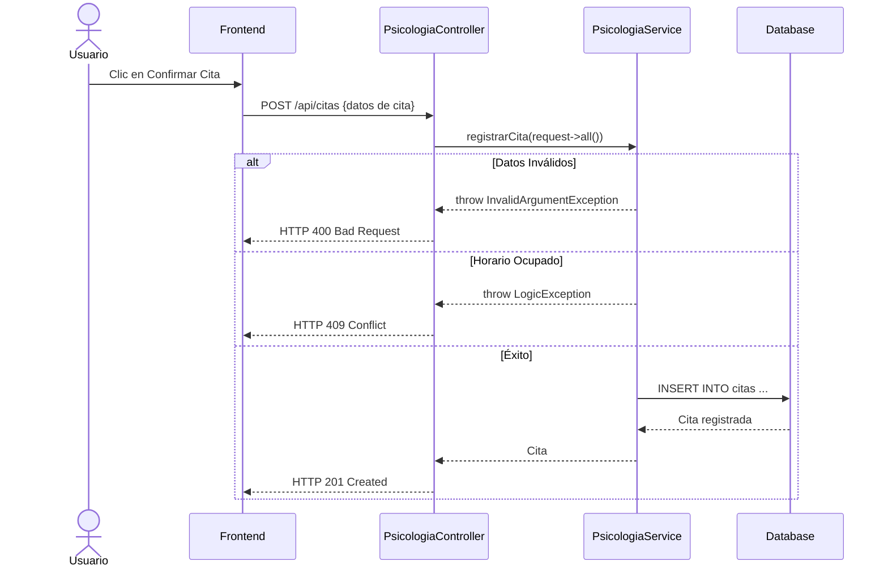
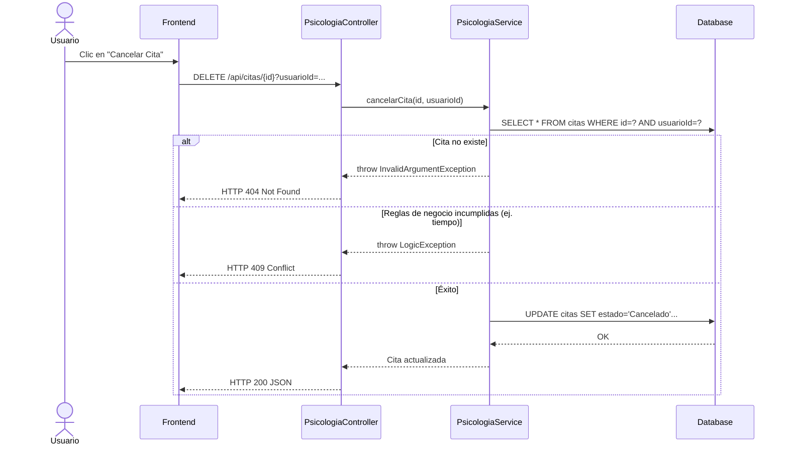

# Servicio de Buses Universitarios (servicio-burra)

## Descripción
> [!WARNING]
> **Código Duplicado Detectado:** Al analizar el código fuente de este microservicio (`servicio-burra`), se encontró que los controladores y rutas corresponden exactamente al módulo de **Psicología** (`PsicologiaController.php`). No existe lógica implementada para "Burras" (buses) en este directorio. A continuación se documenta el flujo real encontrado en el código.

Este microservicio (actualmente con lógica duplicada de Psicología) gestiona la lectura de profesionales psicólogos, visualización de sus bloques horarios disponibles, así como el registro y cancelación de citas por parte de un usuario.

## Arquitectura
- **Backend:** Laravel (`servicio-burra`, contiene `PsicologiaController` y delega a `PsicologiaService`).
- **Base de Datos:** MySQL (Lógica de inserción de citas, lectura de psicólogos).

---

## 1. Función: Listar Psicólogos

### Descripción
Devuelve la lista de profesionales en psicología registrados en el sistema.

### Diagrama Mermaid

---

## 2. Función: Consultar Bloques Disponibles

### Descripción
Dado un `psicologoId` y una `fecha`, devuelve los bloques de horario disponibles para reservar una cita.

### Diagrama Mermaid

---

## 3. Función: Registrar Cita

### Descripción
Recibe un payload JSON para registrar una nueva cita en el horario seleccionado. Puede arrojar conflicto (HTTP 409) si el horario ya fue tomado concurrentemente, o HTTP 400 si faltan datos.

### Diagrama Mermaid

---

## 4. Función: Cancelar Cita

### Descripción
Cancela una cita agendada por el usuario, liberando el bloque. Requiere el `id` de la cita y el `usuarioId` en los parámetros.

### Diagrama Mermaid

