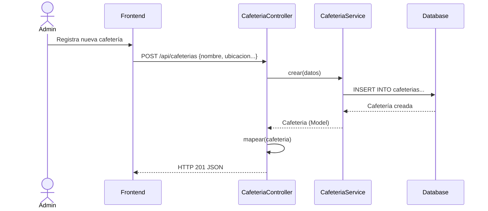
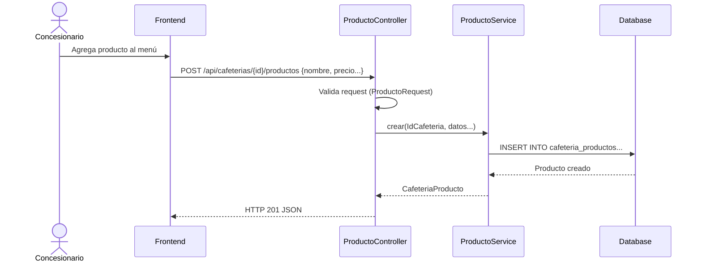
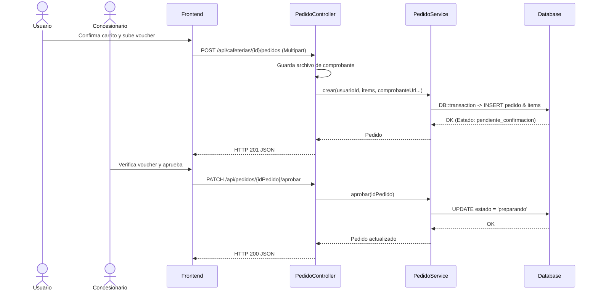
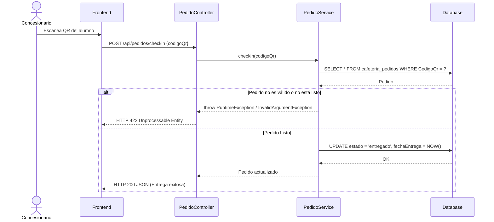

# Servicio de Cafetería (servicio-cafeteria)

## Descripción
Este microservicio administra la red de cafeterías dentro del campus. Gestiona la información de los locales, su inventario (productos) y el flujo completo de pedidos realizados por los usuarios (estudiantes/docentes). Incluye la validación de pagos, cambios de estado del pedido (pendiente, preparando, listo, entregado) y confirmación de recojo mediante código QR.

## Arquitectura
- **Frontend:** React (Llamadas Axios a los endpoints expuestos).
- **Backend:** Laravel (`servicio-cafeteria` con controladores dedicados: `CafeteriaController`, `ProductoController`, `PedidoController`).
- **Base de Datos:** MySQL (Tablas principales: `cafeterias`, `cafeteria_productos`, `cafeteria_pedidos`, `cafeteria_pedido_items`).

---

## 1. Función: Gestión de Cafeterías

### Descripción
Permite a un administrador del sistema listar, registrar y actualizar las concesiones de cafeterías, así como habilitar o deshabilitar su funcionamiento (`cambiarEstado`).

### Diagrama Mermaid

---

## 2. Función: Gestión de Productos (Menú)

### Descripción
Permite al concesionario de una cafetería específica registrar los productos que ofrece (almuerzos, snacks, bebidas), establecer sus precios, stock y disponibilidad.

### Diagrama Mermaid

---

## 3. Función: Realizar y Gestionar Pedidos

### Descripción
Es el flujo core. Un usuario hace un pedido, adjuntando su comprobante de pago. El concesionario aprueba el pago, pasa a prepararlo, notifica que está listo, y finalmente el usuario lo recoge mostrando un QR que el concesionario escanea (checkin).

### Diagrama Mermaid (Creación y Aprobación)

---

## 4. Función: Check-in de Pedido (Código QR)

### Descripción
Cuando el usuario llega a recoger su pedido, el concesionario escanea un código QR generado por la App, lo que valida la entrega y pasa el pedido al estado final `entregado`.

### Diagrama Mermaid

