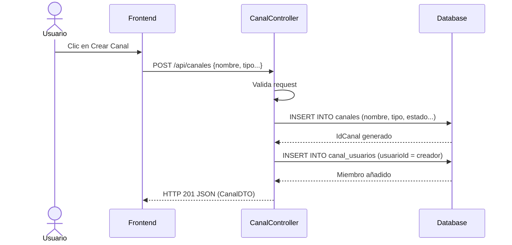
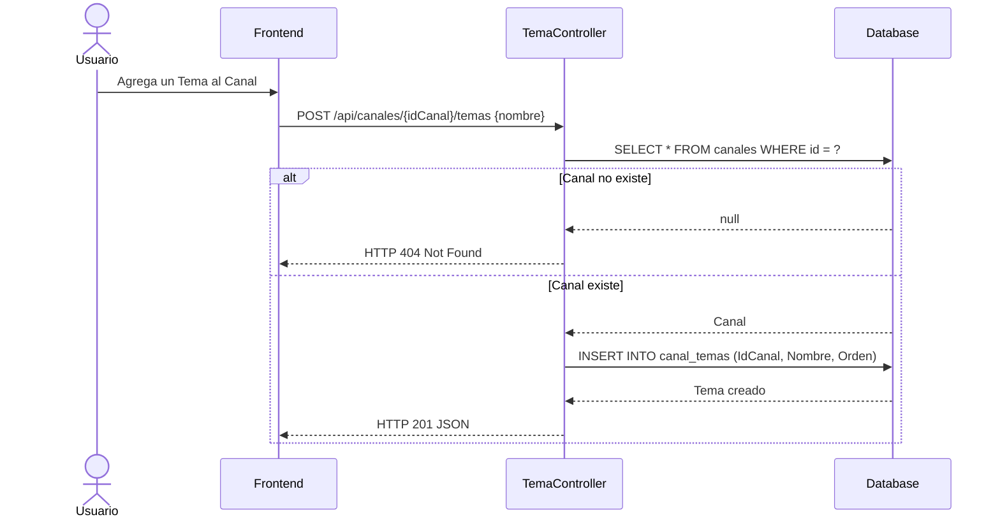
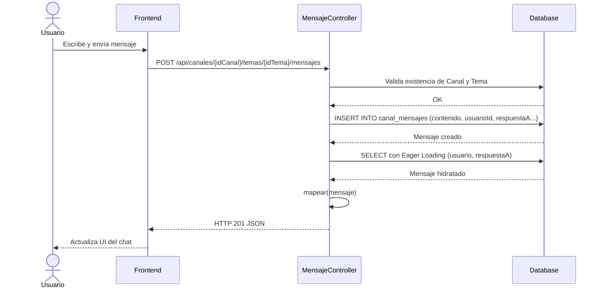
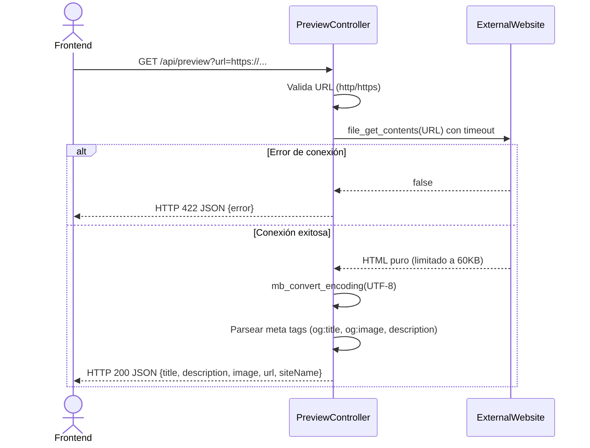

# Servicio de Canales (servicio-canales)

## Descripción
Este microservicio provee la funcionalidad principal para una plataforma de comunicación estilo chat o foros (similar a Slack/Discord). Permite gestionar canales (públicos o privados), organizar discusiones en "temas" (threads/hilos), enviar mensajes con soporte de respuestas e imágenes, reaccionar a mensajes, buscar usuarios para invitar a canales, y generar previsualizaciones de enlaces (URL unfurling).

## Arquitectura
- **Frontend:** React (Llamadas a los endpoints de canales, websockets no evidenciados en las rutas HTTP).
- **Backend:** Laravel (`servicio-canales` con controladores dedicados: `CanalController`, `TemaController`, `MensajeController`, `ReaccionController`, `PreviewController`, `UsuarioController`).
- **Base de Datos:** MySQL (Tablas: `canales`, `canal_temas`, `canal_mensajes`, `canal_usuarios`, `canal_mensaje_reacciones`, `usuarios`).

---

## 1. Función: Gestión de Canales

### Descripción
Crea, lista, actualiza y elimina canales. Un canal puede ser público o privado, y agrupa a varios usuarios (miembros).

### Diagrama Mermaid

---

## 2. Función: Gestión de Temas (Hilos)

### Descripción
Dentro de un canal, la conversación se puede organizar en "temas". Permite CRUD de temas asociados a un `idCanal`.

### Diagrama Mermaid

---

## 3. Función: Mensajería y Respuestas

### Descripción
Permite a los usuarios enviar mensajes a un tema específico. Un mensaje puede ser una respuesta a otro (`idMensajeRespuesta`) e incluir una imagen adjunta (`imagenUrl`). El sistema carga automáticamente el autor y el mensaje original al que se responde.

### Diagrama Mermaid

---

## 4. Función: Previsualización de Enlaces (URL Unfurling)

### Descripción
Cuando un usuario pega una URL en el chat, el Frontend llama a este endpoint para obtener metadatos de la página (título, descripción, imagen OpenGraph) y generar una tarjeta de previsualización rica (estilo Twitter Cards).

### Diagrama Mermaid

