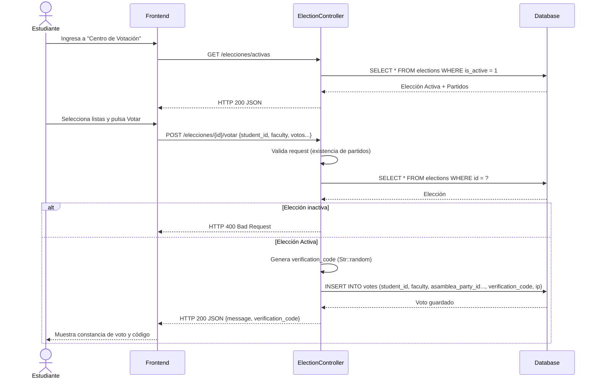
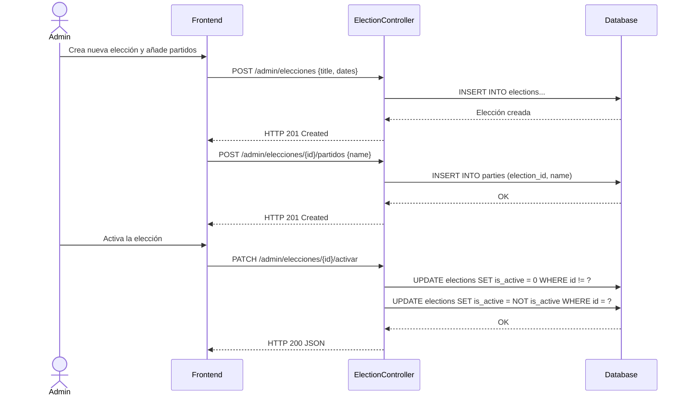
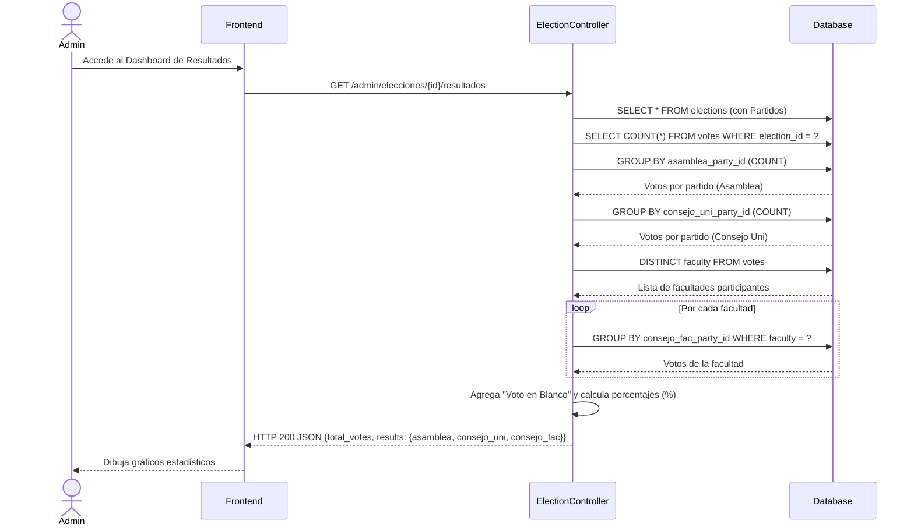

# Servicio de Elecciones (servicio-elecciones)

## Descripción
Este microservicio gestiona los procesos electorales universitarios (Asamblea Universitaria, Consejo Universitario y Consejo de Facultad). Permite a los administradores crear elecciones, registrar agrupaciones políticas (partidos), iniciar un proceso (activar) y contabilizar resultados en tiempo real. Por otro lado, permite a los estudiantes emitir un voto seguro (vinculado a su ID), generar un código de comprobación y consultar si ya votaron.

## Arquitectura
- **Frontend:** React (Pantallas de votación electrónica y dashboard de resultados).
- **Backend:** Laravel (`servicio-elecciones`, controlador `ElectionController`).
- **Base de Datos:** MySQL (Tablas `elections`, `parties`, `votes`).

---

## 1. Función: Votación de Estudiantes

### Descripción
Un estudiante consulta la elección activa y emite su voto para 3 cargos distintos (Asamblea, Consejo Universitario, Consejo de Facultad). El sistema genera un código de verificación único para el estudiante.

### Diagrama Mermaid

---

## 2. Función: Gestión de Elecciones y Partidos (Admin)

### Descripción
Permite a los administradores crear procesos electorales, añadir partidos políticos y decidir qué elección está activa (solo puede haber una activa a la vez).

### Diagrama Mermaid

---

## 3. Función: Resultados en Tiempo Real (Admin)

### Descripción
Calcula la suma total de votos y los porcentajes por cada agrupación política, agrupados por Asamblea, Consejo Universitario y Consejo de Facultad (este último desglosado por facultad). También incluye votos en blanco.

### Diagrama Mermaid

