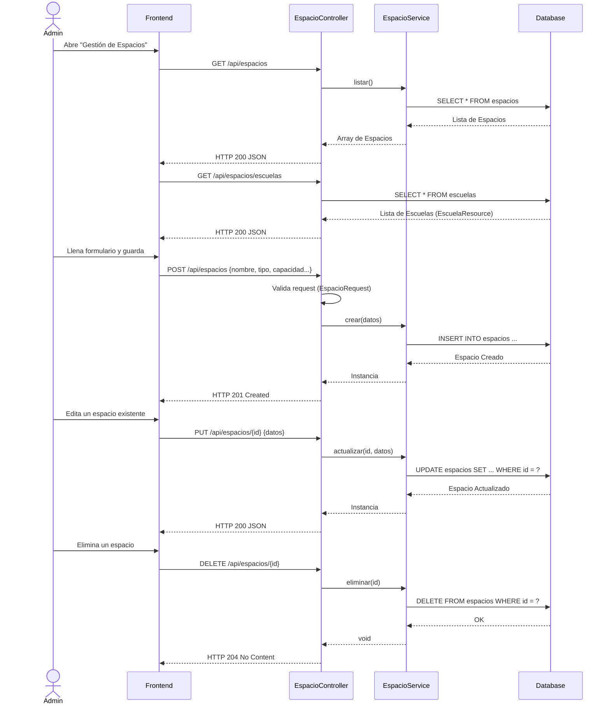

# Servicio de Espacios (servicio-espacios)

## Descripción
Este microservicio administra el catálogo físico de la universidad (Aulas, Laboratorios, Auditorios, Canchas Deportivas, etc.). Permite registrar nuevos espacios, modificarlos, listarlos, eliminarlos y consultar las escuelas a las que pertenecen, sirviendo como catálogo base para el sistema de reservas.

## Arquitectura
- **Frontend:** React (Llamadas CRUD básicas desde el panel de administración).
- **Backend:** Laravel (`servicio-espacios`, controlador `EspacioController`).
- **Base de Datos:** MySQL (Tablas: `espacios`, `escuelas`).

---

## 1. Función: CRUD de Espacios (Listar, Obtener, Crear, Actualizar, Eliminar)

### Descripción
El flujo estándar REST para gestionar los espacios universitarios.

### Diagrama Mermaid

