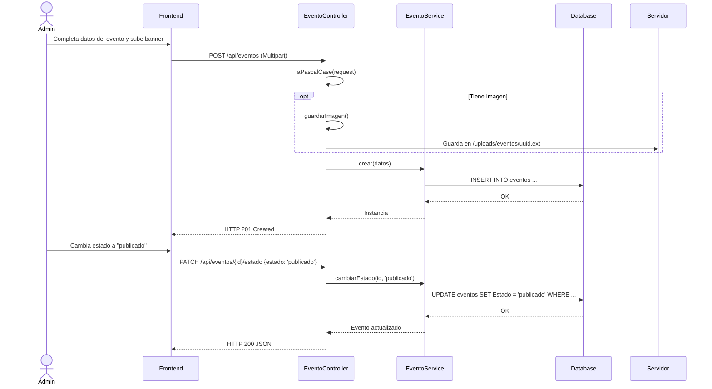
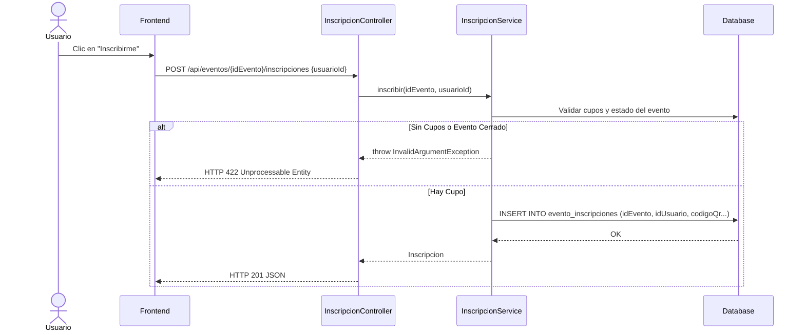
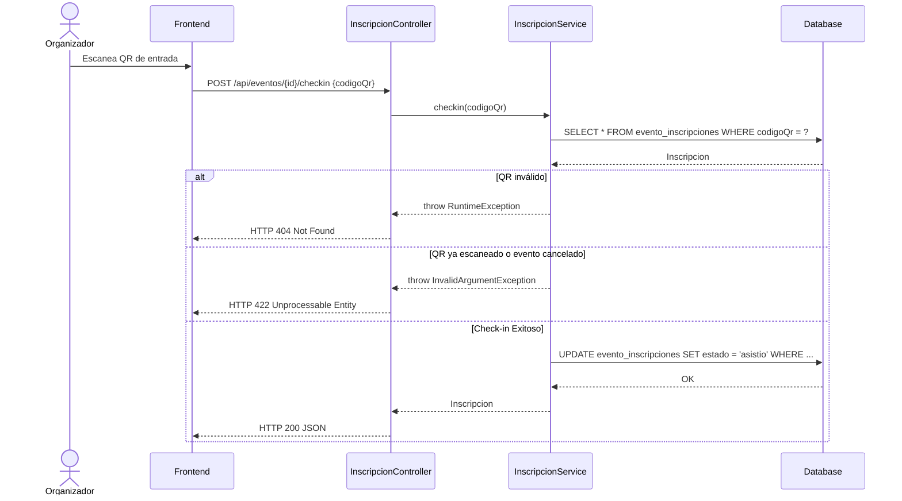
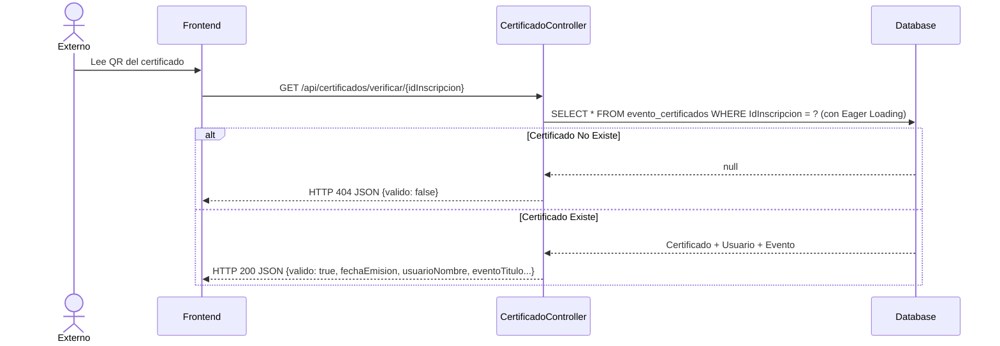

# Servicio de Eventos (servicio-eventos)

## Descripción
Este microservicio gestiona el ciclo completo de eventos universitarios (conferencias, talleres, seminarios). Permite crear eventos, definir su alcance (facultad, escuela o general), gestionar inscripciones de estudiantes/docentes, realizar control de asistencia (check-in con QR) y emitir y verificar certificados digitales.

## Arquitectura
- **Frontend:** React (Gestión de eventos para Admin, Catálogo y Mis Eventos para Usuarios).
- **Backend:** Laravel (`servicio-eventos` con controladores: `EventoController`, `InscripcionController`, `CertificadoController`, `CatalogoController`).
- **Base de Datos:** MySQL (Tablas principales: `eventos`, `evento_inscripciones`, `evento_certificados`).

---

## 1. Función: Gestión de Eventos (CRUD y Estados)

### Descripción
Permite a los administradores crear eventos, subir su imagen (banner), actualizar su información y cambiar su estado a lo largo de su ciclo de vida (`borrador`, `publicado`, `en_curso`, `finalizado`, `cancelado`).

### Diagrama Mermaid

---

## 2. Función: Inscripción a Eventos

### Descripción
Un usuario puede inscribirse a un evento (si hay cupos disponibles). Al inscribirse, se genera automáticamente un Código QR único asociado a esa inscripción.

### Diagrama Mermaid

---

## 3. Función: Control de Asistencia (Check-in con QR)

### Descripción
El día del evento, los administradores escanean el código QR de los asistentes para validar su ingreso (pasa de estado "inscrito" a "asistio").

### Diagrama Mermaid

---

## 4. Función: Verificación de Certificados

### Descripción
Valida la autenticidad de un certificado emitido al finalizar el evento mediante su `idInscripcion`.

### Diagrama Mermaid

