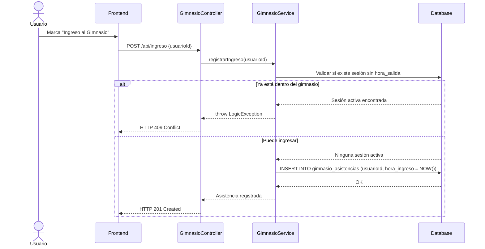
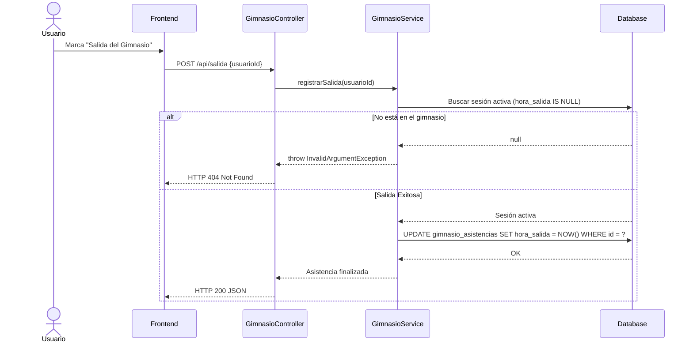
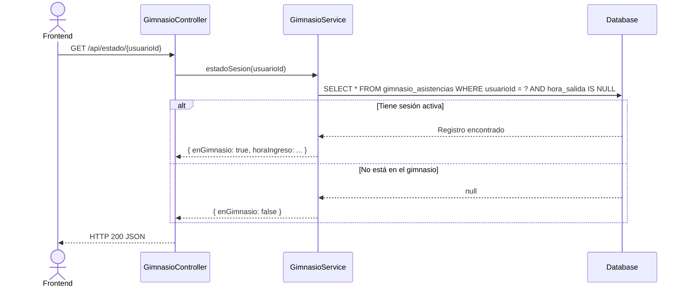
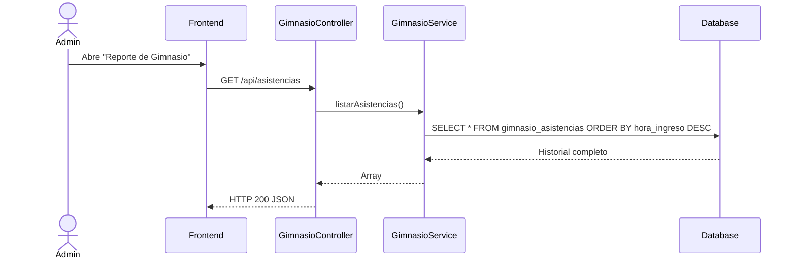

# Servicio de Gimnasio (servicio-gimnasio)

## Descripción
Este microservicio gestiona el control de asistencia y tiempo de uso del gimnasio universitario. Permite a los usuarios (estudiantes/docentes) registrar su hora de entrada y de salida, consultar si actualmente tienen una sesión activa dentro del recinto, y a los administradores les permite listar el historial general de asistencias para control de aforo y reportes.

## Arquitectura
- **Frontend:** React (Aplicación móvil o portal web para escanear QR de entrada/salida o marcar digitalmente).
- **Backend:** Laravel (`servicio-gimnasio`, controlador `GimnasioController`, servicio `GimnasioService`).
- **Base de Datos:** MySQL (Tablas esperadas: `gimnasio_asistencias`).

---

## 1. Función: Registro de Ingreso

### Descripción
Registra la marca de tiempo de entrada de un usuario al gimnasio. Valida que el usuario no tenga ya una sesión activa (es decir, que haya ingresado pero no marcado su salida).

### Diagrama Mermaid

---

## 2. Función: Registro de Salida

### Descripción
Registra la marca de tiempo de salida de un usuario. Requiere que el usuario tenga una sesión activa previamente registrada el mismo día.

### Diagrama Mermaid

---

## 3. Función: Consultar Estado de Sesión Actual

### Descripción
Endpoint utilizado para que la Interfaz de Usuario determine qué botón mostrar ("Registrar Ingreso" o "Registrar Salida") consultando si el usuario está actualmente dentro del gimnasio.

### Diagrama Mermaid

---

## 4. Función: Listar Asistencias (Historial)

### Descripción
Endpoint administrativo para listar todas las asistencias registradas, útil para generar reportes de horas pico y controlar el aforo histórico.

### Diagrama Mermaid

