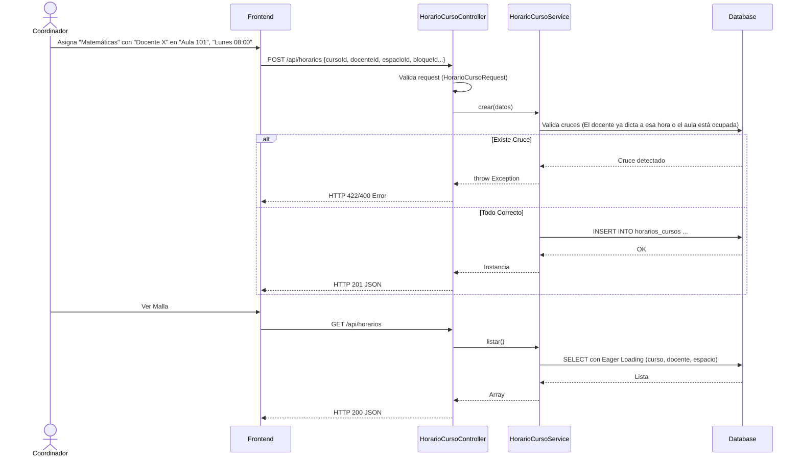
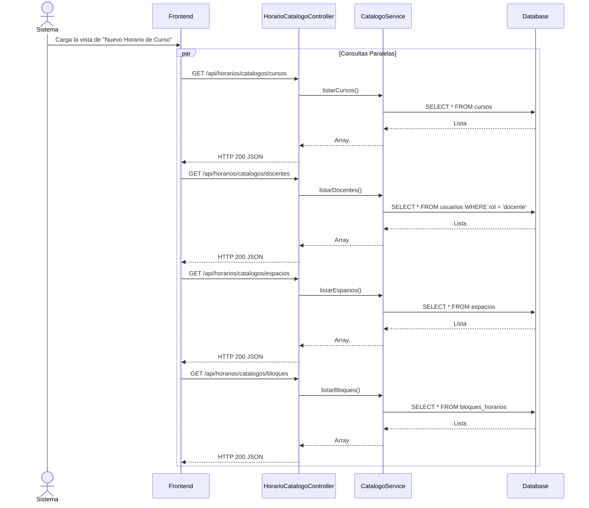

# Servicio de Horarios de Cursos (servicio-horarios-curso)

## Descripción
Este microservicio se enfoca en la asignación académica. Se encarga de vincular un Curso, un Docente, un Espacio Físico (Aula/Laboratorio) y un Bloque de tiempo. Es la pieza central que permite construir la malla horaria académica (el horario de clases) de la universidad.

## Arquitectura
- **Frontend:** React (Pantalla de "Gestión de Horarios Académicos").
- **Backend:** Laravel (`servicio-horarios-curso`, controladores `HorarioCursoController` y `HorarioCatalogoController`).
- **Base de Datos:** MySQL (Tablas esperadas: `horarios_cursos` y dependencias a `cursos`, `usuarios/docentes`, `espacios`, `bloques`).

---

## 1. Función: Gestión del Horario Académico (CRUD)

### Descripción
Permite listar el horario de clases, buscar un registro específico, así como crear, modificar o eliminar una asignación de clase (Curso + Docente + Espacio + Bloque).

### Diagrama Mermaid

---

## 2. Función: Catálogos de Soporte

### Descripción
Para construir la malla horaria, el frontend requiere poblar los `selects` (comboboxes) con las listas maestras de Cursos, Docentes, Espacios y Bloques horarios disponibles.

### Diagrama Mermaid

