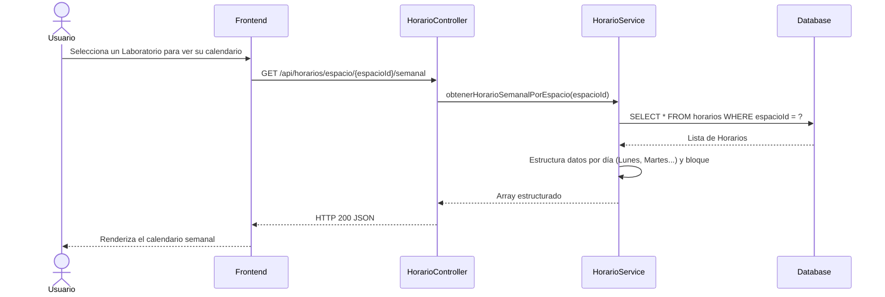
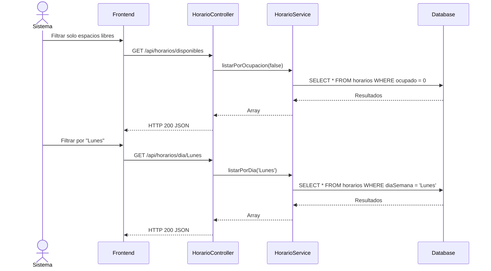
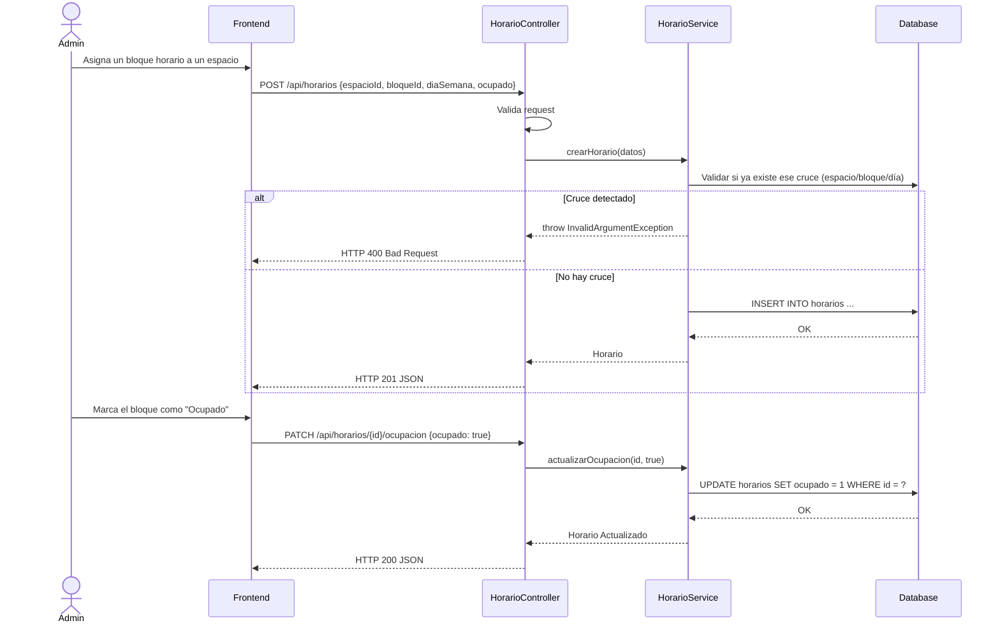

# Servicio de Horarios (servicio-horarios)

## Descripción
Este microservicio administra la disponibilidad horaria de los diferentes espacios físicos de la universidad. Define en qué bloques horarios (ej. 08:00 - 10:00) y qué días de la semana un espacio está disponible u ocupado. Es consumido fundamentalmente por el sistema de reservas para saber cuándo se puede agendar un ambiente.

## Arquitectura
- **Frontend:** React (Calendarios y vistas de disponibilidad de espacios).
- **Backend:** Laravel (`servicio-horarios`, controlador `HorarioController`).
- **Base de Datos:** MySQL (Tablas: `horarios`, con llaves foráneas a `espacios` y `bloques`).

---

## 1. Función: Consultar Disponibilidad de un Espacio

### Descripción
Recupera el horario de un espacio particular, ya sea en un formato lineal (lista) o estructurado en formato semanal (matriz Día x Bloque).

### Diagrama Mermaid

---

## 2. Función: Buscar Espacios por Disponibilidad / Día

### Descripción
Permite listar todos los horarios que actualmente constan como "disponibles" (o bien ocupados), y también permite buscar qué hay programado en un día de la semana específico.

### Diagrama Mermaid

---

## 3. Función: CRUD y Cambio de Ocupación

### Descripción
Gestión administrativa de los horarios. Permite crear nuevos registros de disponibilidad y cambiar ágilmente el estado de ocupación de un horario específico (útil cuando se aprueba una reserva y ese bloque pasa a estar ocupado).

### Diagrama Mermaid

