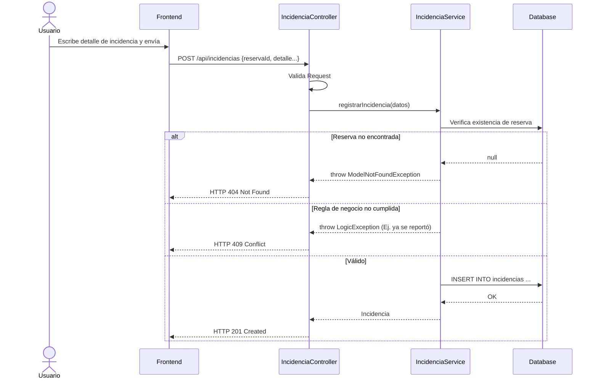
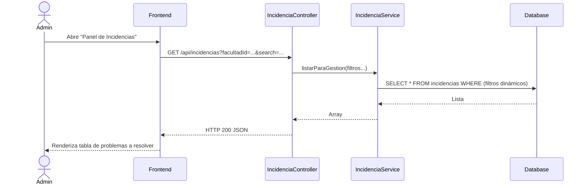
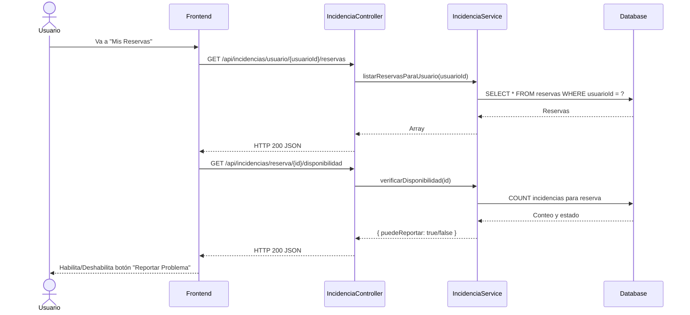

# Servicio de Incidencias (servicio-incidencia)

## Descripción
Este microservicio está destinado al reporte de problemas, daños o anomalías encontradas en los espacios físicos después de una reserva (por ejemplo, proyector dañado, sillas rotas, limpieza deficiente). Permite a los usuarios registrar la incidencia y a los administradores gestionar su seguimiento.

## Arquitectura
- **Frontend:** React (Sección de "Mis Reservas" para reportar problemas, y "Panel de Incidencias" para administradores).
- **Backend:** Laravel (`servicio-incidencia`, controlador `IncidenciaController`).
- **Base de Datos:** MySQL (Tablas esperadas: `incidencias`, relacionándose indirectamente con `reservas` y `usuarios`).

---

## 1. Función: Reportar una Incidencia

### Descripción
Permite a un usuario (estudiante o docente) que ha hecho uso de una reserva, reportar un problema ocurrido durante la misma.

### Diagrama Mermaid

---

## 2. Función: Gestión de Incidencias (Admin)

### Descripción
Lista todas las incidencias reportadas en el sistema, permitiendo filtrar por facultad, escuela, espacio o mediante una búsqueda de texto.

### Diagrama Mermaid

---

## 3. Función: Consultar Historial y Disponibilidad de Reserva

### Descripción
El sistema provee endpoints auxiliares para saber si una reserva específica permite aún reportar incidencias (`verificarDisponibilidad`), ver el historial de problemas de una reserva y listar las reservas pasadas de un usuario para que pueda reportar sobre ellas.

### Diagrama Mermaid

