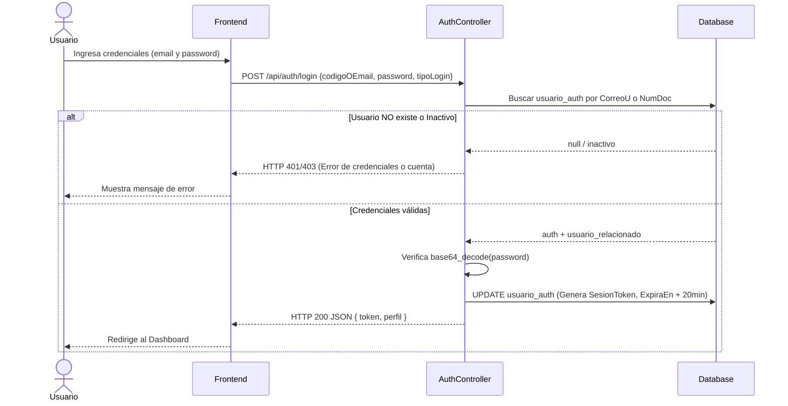
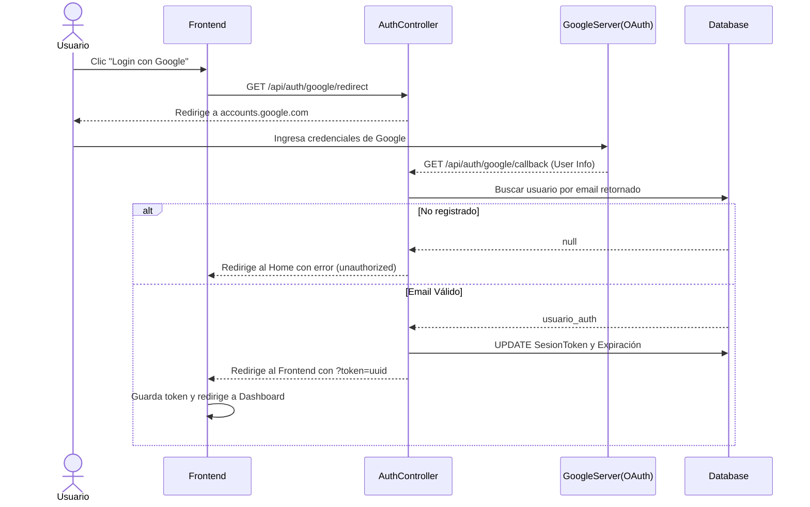
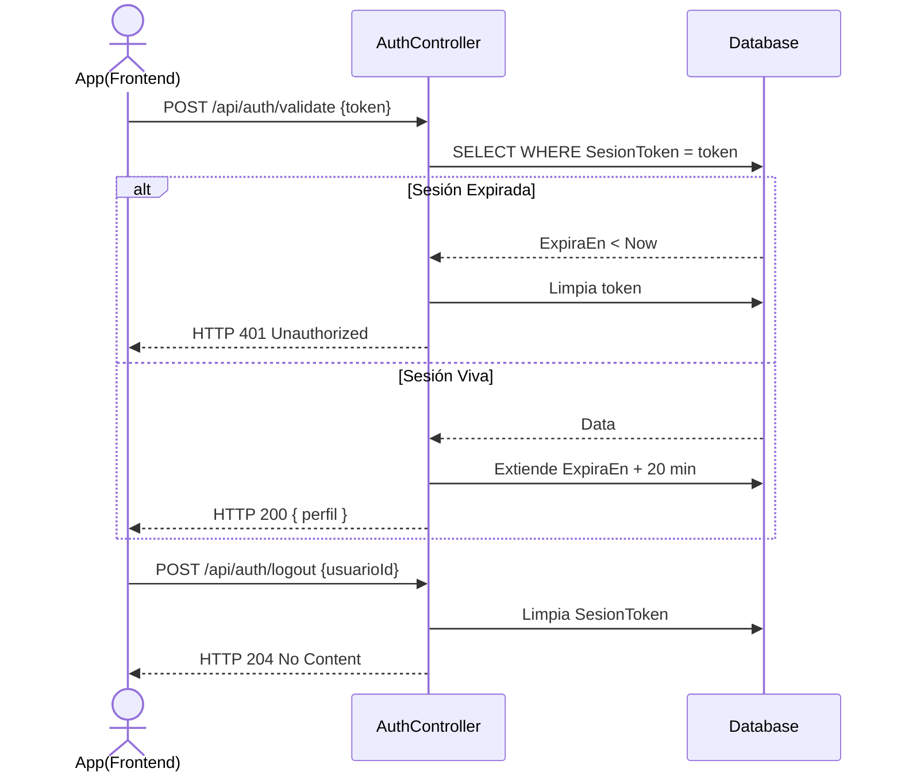

# Servicio de Autenticación (servicio-login)

## Descripción
Este microservicio gestiona la identidad, el inicio de sesión y el control de sesiones de los usuarios dentro de IntegraUpt. Provee autenticación local mediante credenciales (Código/Email y Contraseña) y también está preparado para delegación de identidad (SSO) mediante Google OAuth para cuentas institucionales. Genera y administra los tokens de sesión utilizados por el frontend para consumir el resto de servicios.

## Arquitectura
- **Frontend:** React (Pantalla inicial de Login y redireccionamientos OAuth).
- **Backend:** Laravel (`servicio-login`, controlador `AuthController`). Usa `Laravel Socialite` para la integración con Google.
- **Base de Datos:** MySQL (Tablas: `usuario_auth` para credenciales y tokens de sesión; relación con `usuario`).

---

## 1. Función: Inicio de Sesión Tradicional (Local)

### Descripción
El usuario ingresa su código o email y contraseña. El sistema verifica las credenciales, valida si la cuenta está activa y si pertenece al rol correspondiente al portal que intenta acceder (Académico o Administrativo), y retorna un token de sesión.

### Diagrama Mermaid

---

## 2. Función: Inicio de Sesión con Google (OAuth 2.0)

### Descripción
Permite a los usuarios acceder al sistema haciendo clic en "Iniciar sesión con Google". El backend redirige a los servidores de Google, y una vez aprobados, Google retorna los datos del usuario. Si el correo existe en nuestra base de datos, se genera la sesión.

### Diagrama Mermaid

---

## 3. Función: Validación de Sesión y Cierre de Sesión

### Descripción
El frontend invoca periódicamente `validateToken` para verificar si la sesión sigue viva y renovar el tiempo de inactividad (+20 min). También incluye la función `logout` explícita que anula el token.

### Diagrama Mermaid

