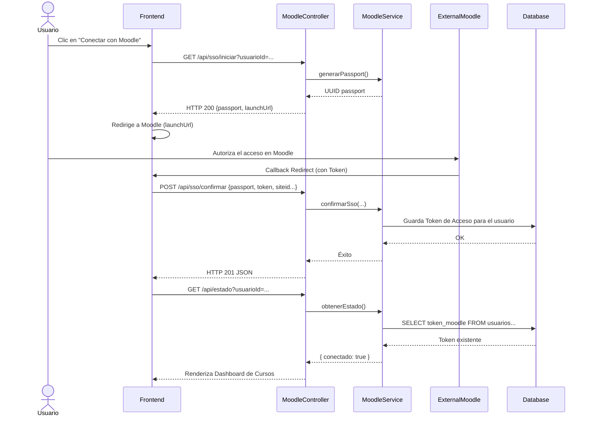
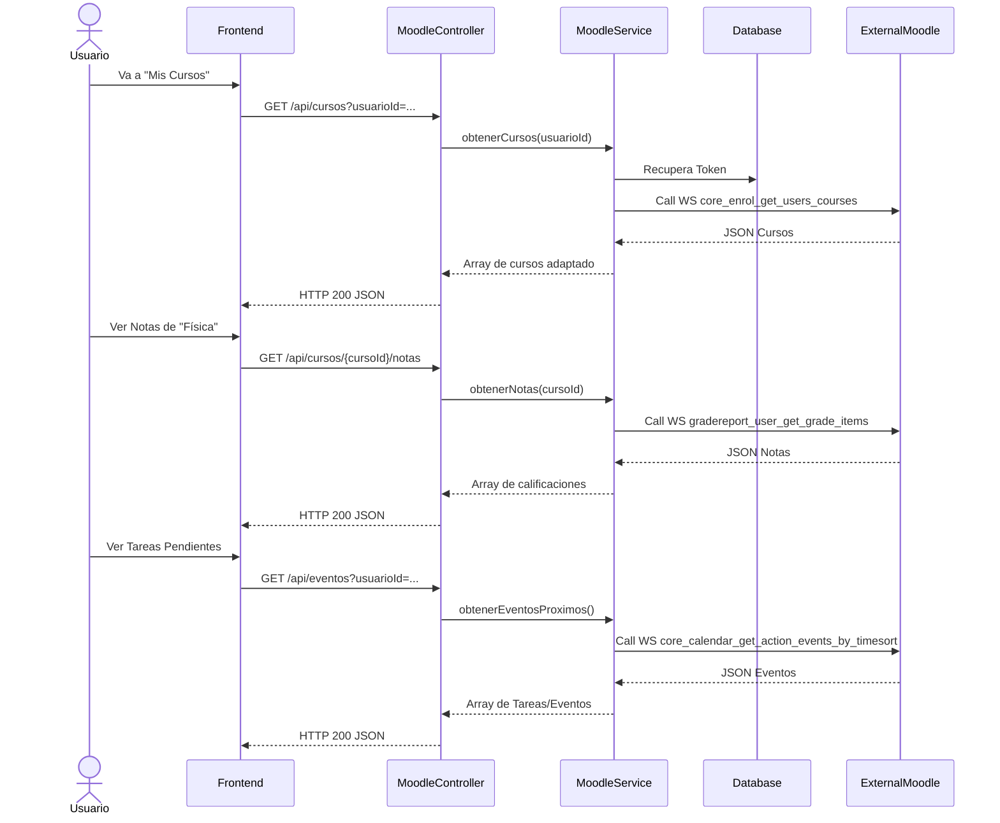

# Servicio Moodle (servicio-moodle)

## Descripción
Este microservicio actúa como un puente o gateway de integración entre la intranet universitaria y la plataforma virtual de aprendizaje (Moodle). Permite a los usuarios enlazar sus cuentas institucionales, usar Single Sign-On (SSO) y consultar directamente sus cursos matriculados, calificaciones y próximos eventos o tareas del aula virtual sin tener que salir de la aplicación de la universidad.

## Arquitectura
- **Frontend:** React (Sección "Aula Virtual" con flujos de autenticación OAuth/SSO).
- **Backend:** Laravel (`servicio-moodle`, controlador `MoodleController` y `MoodleService`).
- **Integración Externa:** Se comunica mediante API REST / Web Services con la instancia externa de Moodle.
- **Base de Datos:** MySQL (Almacena tokens de acceso en tabla asociada al usuario).

---

## 1. Función: Conexión de Cuenta y SSO (Single Sign-On)

### Descripción
Un usuario puede vincular su cuenta de dos formas: ingresando su usuario y contraseña de Moodle directamente (`conectar`) o iniciando un flujo seguro SSO (`iniciarSso` y `confirmarSso`), que evita manejar credenciales.

### Diagrama Mermaid

---

## 2. Función: Consultar Cursos, Tareas y Notas

### Descripción
Una vez vinculada la cuenta, el usuario puede ver la lista de cursos en los que está matriculado actualmente, así como consultar su libreta de notas (calificaciones) y próximos eventos del calendario (tareas que vencen pronto).

### Diagrama Mermaid

