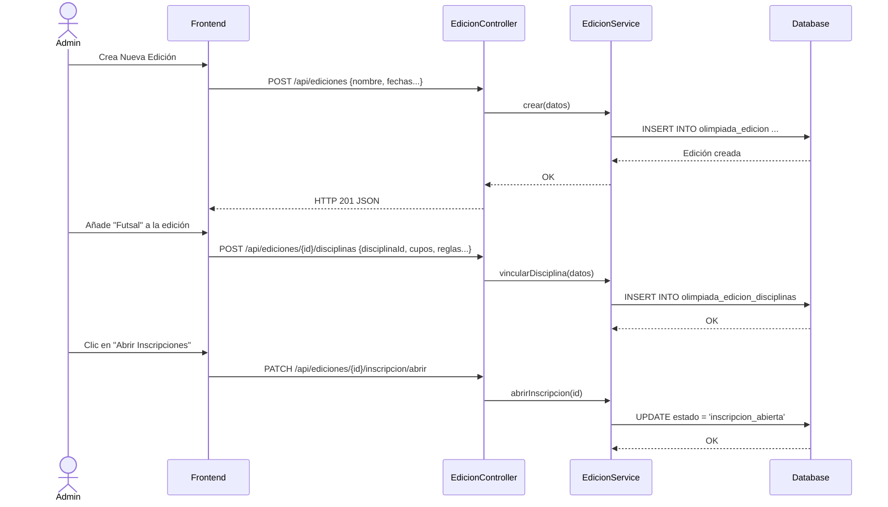
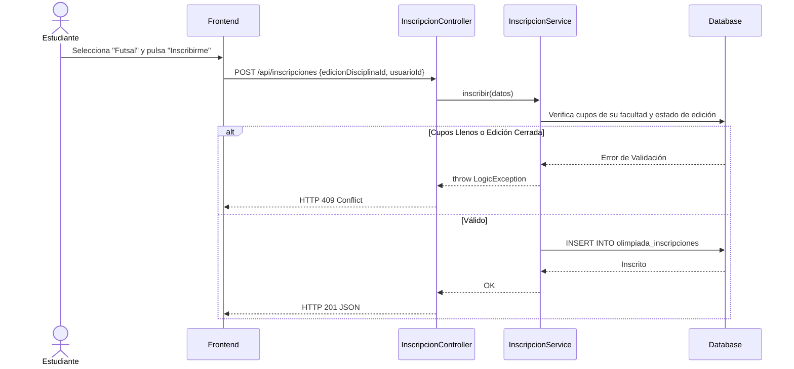
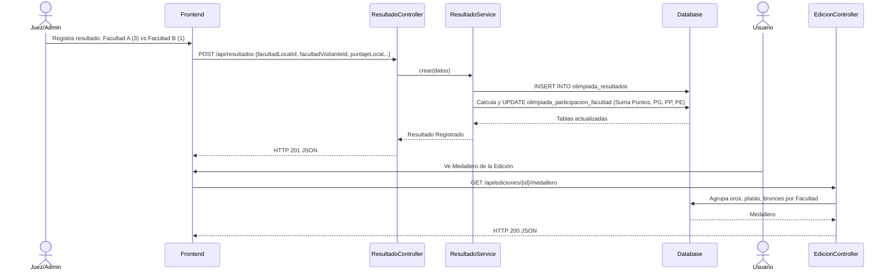
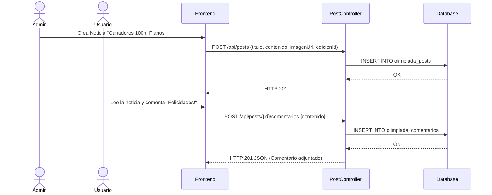

# Servicio de Olimpiadas Universitarias (servicio-olimpiadas)

## Descripción
Este microservicio gestiona el evento anual (o semestral) de las Olimpiadas Interfacultades de la universidad. Cubre desde la definición de disciplinas deportivas (fútbol, básquet, ajedrez, e-sports), la creación de "Ediciones" (Olimpiadas 2026), el proceso de inscripción de estudiantes por facultad, hasta la gestión de fixtures (partidos), tablas de posiciones, medalleros y una sección de blog (posts) para noticias del evento.

## Arquitectura
- **Frontend:** React (Sección "Olimpiadas" con portal de noticias, fixture en vivo, medallero y panel de inscripción).
- **Backend:** Laravel (`servicio-olimpiadas`, múltiples controladores: `EdicionController`, `DisciplinaController`, `InscripcionController`, `ResultadoController`, `PostController`).
- **Base de Datos:** MySQL (Extenso modelo de datos que cruza facultades, estudiantes, disciplinas, partidos y resultados).

---

## 1. Función: Gestión de la Edición Olímpica (Admin)

### Descripción
Un administrador crea una nueva "Edición" (ej. "Olimpiadas de Invierno 2026"), vincula las disciplinas deportivas que se jugarán en esa edición, y controla el ciclo de vida del evento (Abre/cierra inscripciones, inicia los juegos, finaliza).

### Diagrama Mermaid

---

## 2. Función: Inscripción de Deportistas

### Descripción
Los estudiantes pueden inscribirse a las disciplinas habilitadas para su facultad durante el período abierto de inscripciones.

### Diagrama Mermaid

---

## 3. Función: Fixtures y Tablas de Resultados en Vivo

### Descripción
Registra los resultados de los partidos disputados (fixture), tabla de posiciones general por deporte y la lista de anotadores (goleadores). Se usa para generar el medallero.

### Diagrama Mermaid

---

## 4. Función: Blog de Noticias (Posts)

### Descripción
Mini-foro integrado donde la organización pública anuncios, fotos de los ganadores o comunicados, y los usuarios pueden dejar comentarios.

### Diagrama Mermaid

