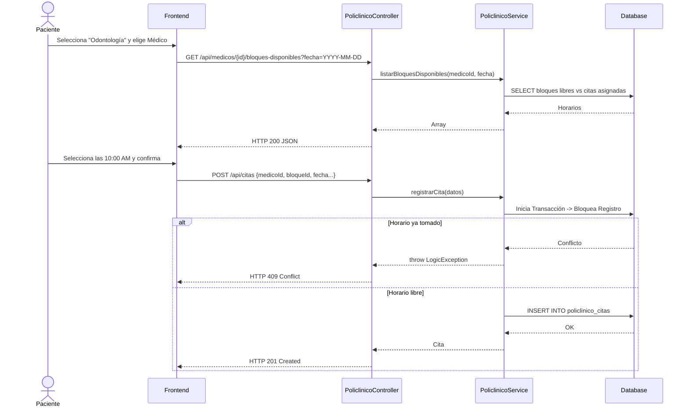
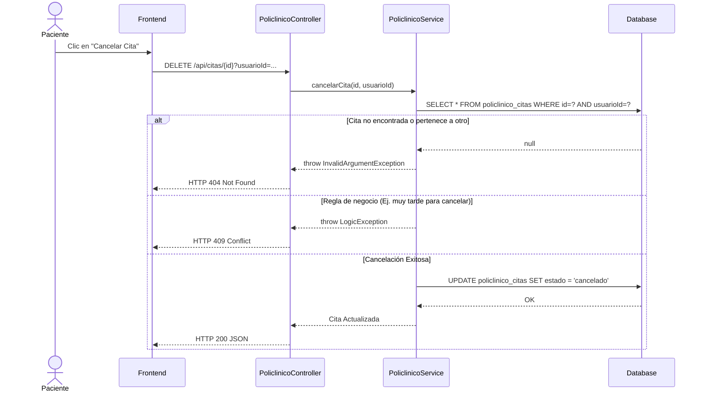
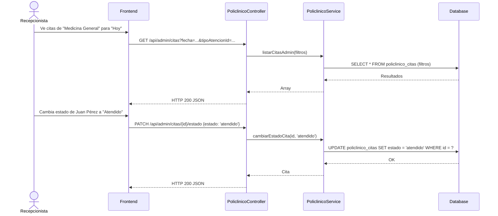
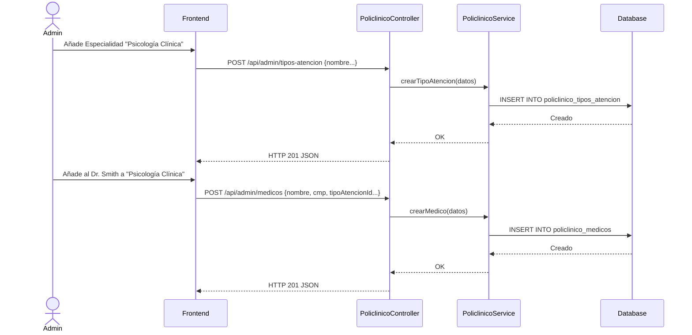

# Servicio de Policlínico (servicio-policlinico)

## Descripción
Este microservicio gestiona la atención primaria de salud dentro del campus (Policlínico Universitario). Permite a los administradores gestionar los tipos de atención (medicina general, odontología, triaje), registrar a los médicos especialistas y controlar los horarios. Por el lado del paciente, permite consultar horarios disponibles y agendar o cancelar citas médicas.

## Arquitectura
- **Frontend:** React (Portal del Paciente para agendar citas y Portal Administrativo para gestión de médicos y estados de citas).
- **Backend:** Laravel (`servicio-policlinico`, controlador `PoliclinicoController`).
- **Base de Datos:** MySQL (Tablas: `policlinico_tipos_atencion`, `policlinico_medicos`, `policlinico_citas`).

---

## 1. Función: Reserva de Cita Médica (Paciente)

### Descripción
El paciente busca una especialidad (tipo de atención), elige un médico, consulta su horario disponible y reserva un bloque. Si el bloque se ocupó concurrentemente, el sistema rechaza la operación.

### Diagrama Mermaid

---

## 2. Función: Cancelar Cita (Paciente)

### Descripción
Un paciente puede cancelar su cita antes de la fecha programada, liberando así el bloque horario para otro paciente.

### Diagrama Mermaid

---

## 3. Función: Gestión de Citas y Recepción (Administrativo)

### Descripción
El personal del policlínico visualiza todas las citas del día, filtra por médico o estado y actualiza el estado de la cita conforme el paciente avanza (Atendido, No Asistió).

### Diagrama Mermaid

---

## 4. Función: Administración del Catálogo (Especialidades y Médicos)

### Descripción
Mantenimiento CRUD para crear nuevos tipos de atención (triaje, enfermería, etc.) y registrar nuevos profesionales de la salud.

### Diagrama Mermaid

