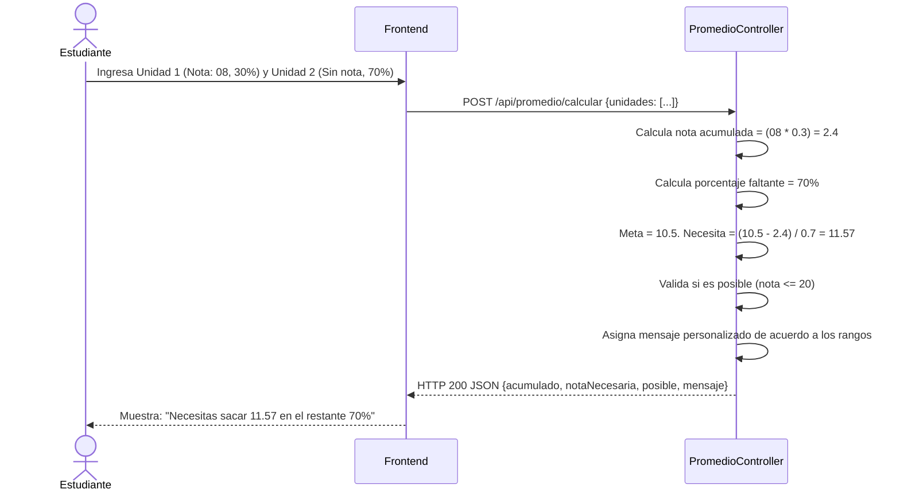

# Servicio de Calculadora de Promedios (servicio-promedio)

## Descripción
Este es un microservicio utilitario y sin estado (stateless) diseñado para ayudar a los estudiantes a proyectar sus calificaciones. Basado en las notas obtenidas y el peso porcentual de cada unidad académica, calcula cuánto necesita sacar el estudiante en las siguientes evaluaciones para aprobar el curso (la nota aprobatoria es 10.5).

## Arquitectura
- **Frontend:** React (Calculadora interactiva donde el estudiante ingresa las notas que ya tiene y los porcentajes).
- **Backend:** Laravel (`servicio-promedio`, controlador único `PromedioController`). No requiere conexión a base de datos.
- **Base de Datos:** N/A (Es una API de cálculo matemático puro en memoria).

---

## 1. Función: Calcular Promedio Proyectado

### Descripción
Recibe un arreglo de unidades (cada una con su `nota` obtenida y su `porcentaje` respectivo). Suma lo acumulado y calcula, sobre el porcentaje faltante, la nota exacta que el alumno necesita en las próximas evaluaciones para llegar a 10.5. También devuelve mensajes personalizados (ej. "Tan cerca y a la vez tan lejos", "Al otro año será").

### Diagrama Mermaid

