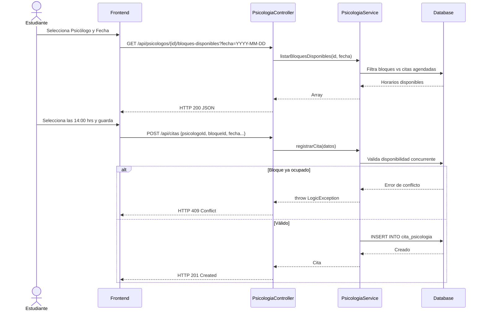
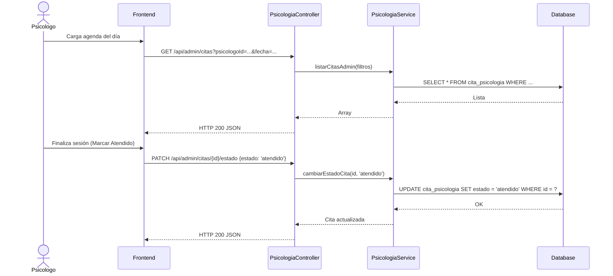
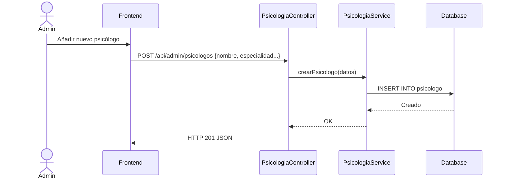

# Servicio de Psicología (servicio-psicologia)

## Descripción
Este microservicio gestiona las citas y atención del área de Bienestar Universitario, específicamente para el soporte psicológico de los estudiantes. Comparte gran parte de la estructura y lógica con el servicio del policlínico, pero se maneja de forma independiente para asegurar la privacidad y la segregación del staff (psicólogos vs médicos generales).

## Arquitectura
- **Frontend:** React (Módulo "Bienestar Estudiantil").
- **Backend:** Laravel (`servicio-psicologia`, controlador `PsicologiaController`).
- **Base de Datos:** MySQL (Tablas esperadas: `psicologo`, `cita_psicologia`).

---

## 1. Función: Reserva de Cita Psicológica (Estudiante)

### Descripción
El estudiante selecciona a un psicólogo (o se le asigna uno), visualiza sus horarios libres (bloques) para un día particular y agenda la cita, enviando opcionalmente un motivo.

### Diagrama Mermaid

---

## 2. Función: Gestión de Citas (Psicólogo / Admin)

### Descripción
El psicólogo o personal administrativo puede listar las citas agendadas para el día y actualizar su estado (por ejemplo, a "Atendido", "Falta").

### Diagrama Mermaid

---

## 3. Función: Catálogo de Psicólogos (CRUD)

### Descripción
Permite a los administradores de Bienestar Universitario registrar a los psicólogos que atienden a los estudiantes y darles de baja cuando dejen de laborar.

### Diagrama Mermaid

