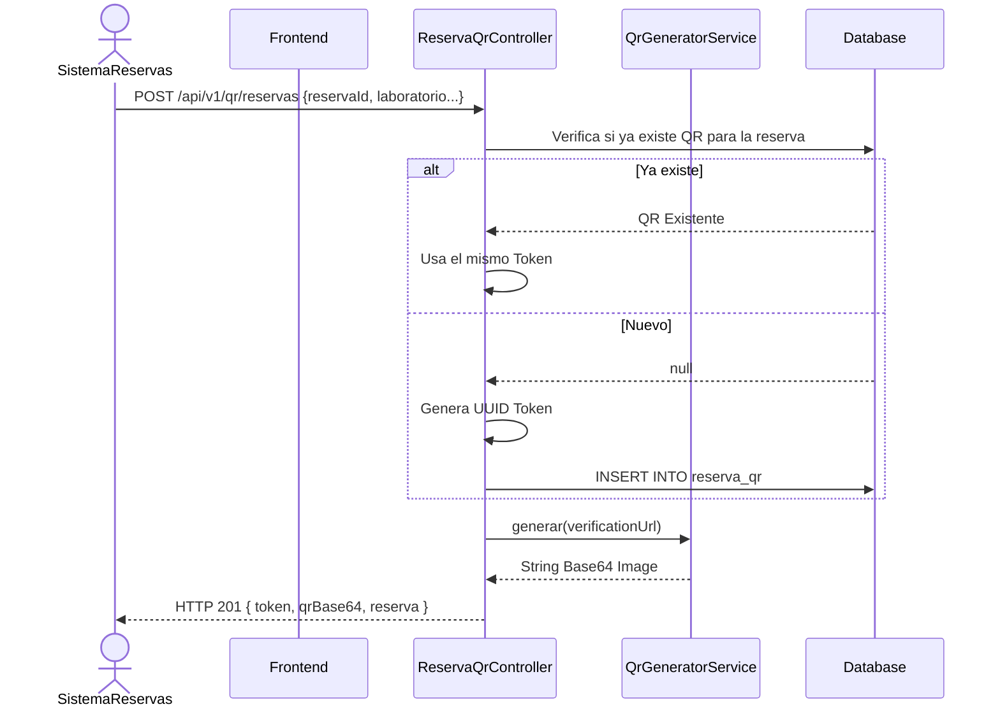
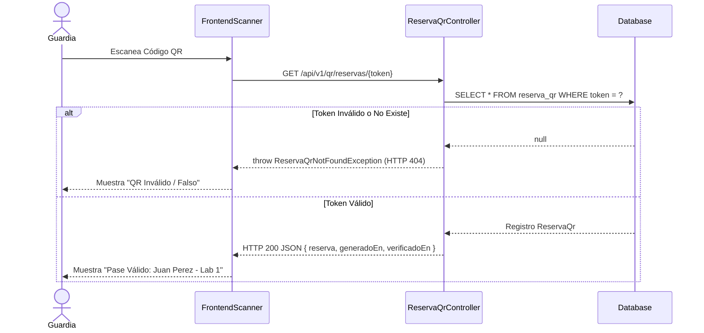

# Servicio de Generación QR (servicio-qr)

## Descripción
Este microservicio es responsable de la generación, almacenamiento y validación de Códigos QR para el sistema de reservas. Cuando se aprueba una reserva, el sistema genera un pase digital (QR) que el estudiante puede presentar físicamente en la puerta del laboratorio o ambiente para validar su acceso.

## Arquitectura
- **Frontend:** React (Aplicación móvil para escanear y pantalla web para visualizar el código generado).
- **Backend:** Laravel (`servicio-qr`, controlador `ReservaQrController`).
- **Base de Datos:** MySQL (Tabla: `reserva_qr` que almacena el token único y un caché de los datos básicos de la reserva para validaciones rápidas).

---

## 1. Función: Generar Código QR de Reserva

### Descripción
Recibe los datos de una reserva aprobada y genera un UUID único (`token`), lo asocia a la reserva y retorna la imagen codificada en Base64 junto con la URL de verificación.

### Diagrama Mermaid

---

## 2. Función: Verificar y Leer Código QR

### Descripción
Un guardia o encargado de laboratorio escanea el QR desde su celular, el cual lo redirige (o consume el endpoint por API) enviando el token UUID para validar si el pase es legítimo y corresponde a una reserva activa en ese momento.

### Diagrama Mermaid

