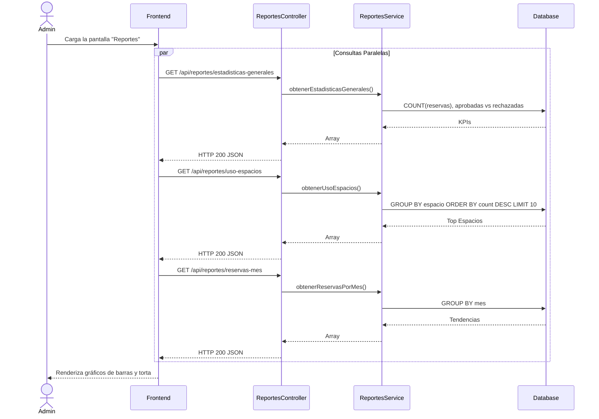
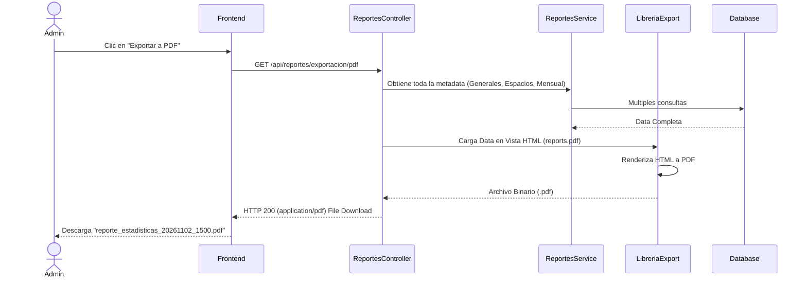

# Servicio de Reportes (servicio-reportes)

## Descripción
Este microservicio administrativo tiene el propósito de consolidar la información del sistema de reservas para extraer métricas y estadísticas relevantes de uso institucional. Provee al dashboard del administrador datos consolidados (KPIs) y permite exportar dichos resultados en formatos de reporte estándar (PDF y Excel).

## Arquitectura
- **Frontend:** React (Sección "Dashboard / Reportes" del panel de administración).
- **Backend:** Laravel (`servicio-reportes`, controlador `ReportesController`). Usa librerías como `barryvdh/laravel-dompdf` para PDF y `maatwebsite/excel` para Excel.
- **Base de Datos:** MySQL (Consulta intensiva sobre tablas de `reserva`, `espacio`, etc., mediante queries agregadas `GROUP BY`).

---

## 1. Función: Dashboards Estadísticos (APIs JSON)

### Descripción
Provee información estructurada para renderizar los gráficos de la interfaz (ej. Gráficos de barra, pie o líneas). Obtiene KPIs generales, top espacios más usados y la curva de crecimiento de reservas por mes.

### Diagrama Mermaid

---

## 2. Función: Exportación Documental (PDF y Excel)

### Descripción
Permite a la gerencia descargar un reporte formal (imprimible o calculable) con toda la consolidación estadística generada por el sistema.

### Diagrama Mermaid

