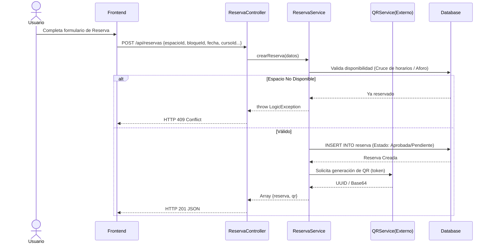
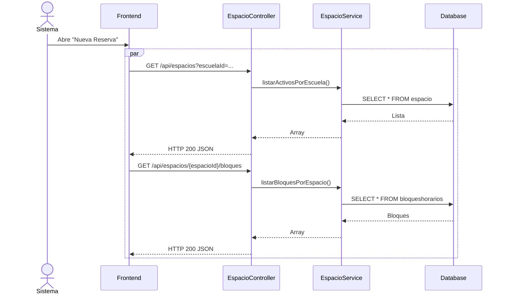
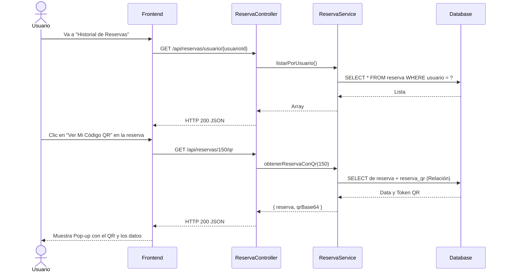

# Servicio de Reservas (servicio-reserva)

## Descripción
Este es el microservicio central o "core" de todo el ecosistema IntegraUpt. Gestiona el proceso completo de apartar un ambiente físico (laboratorio, salón especial, auditorio) por parte de un usuario (generalmente docentes para sus cursos). Involucra catálogos básicos (facultades, escuelas), espacios físicos, y las reservas en sí, coordinándose estrechamente con el servicio QR para generar los pases de acceso.

## Arquitectura
- **Frontend:** React (Pantalla "Mis Reservas", "Crear Reserva" y calendarios de disponibilidad).
- **Backend:** Laravel (`servicio-reserva`, controladores `ReservaController`, `EspacioController`, `CatalogoController`).
- **Base de Datos:** MySQL (Tablas: `reserva`, `espacio`, `cursos`, `bloqueshorarios`).

---

## 1. Función: Creación de una Reserva (Docente/Usuario)

### Descripción
Un usuario solicita un espacio físico para una fecha y bloque horario determinado, vinculándolo al curso que dictará. El sistema valida cruces y, si se aprueba la reserva (automáticamente o mediante reglas de negocio), se coordina la generación del pase QR.

### Diagrama Mermaid

---

## 2. Función: Consultar Catálogo de Espacios y Bloques

### Descripción
Antes de poder reservar, el frontend necesita llenar los campos desplegables (`selects`) con los laboratorios existentes y saber en qué bloques horarios atienden (ej. 8:00 - 10:00).

### Diagrama Mermaid

---

## 3. Función: Gestión de "Mis Reservas" y Pases QR

### Descripción
El usuario puede visualizar todas sus reservas pasadas y futuras. Desde esta pantalla, puede solicitar la visualización de su pase QR para presentarlo a la entrada del laboratorio.

### Diagrama Mermaid

