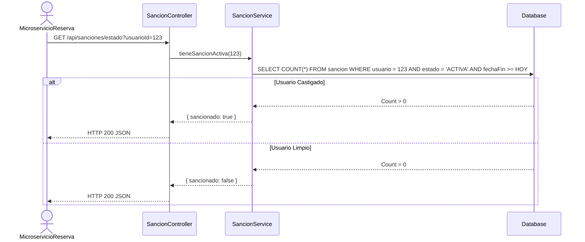
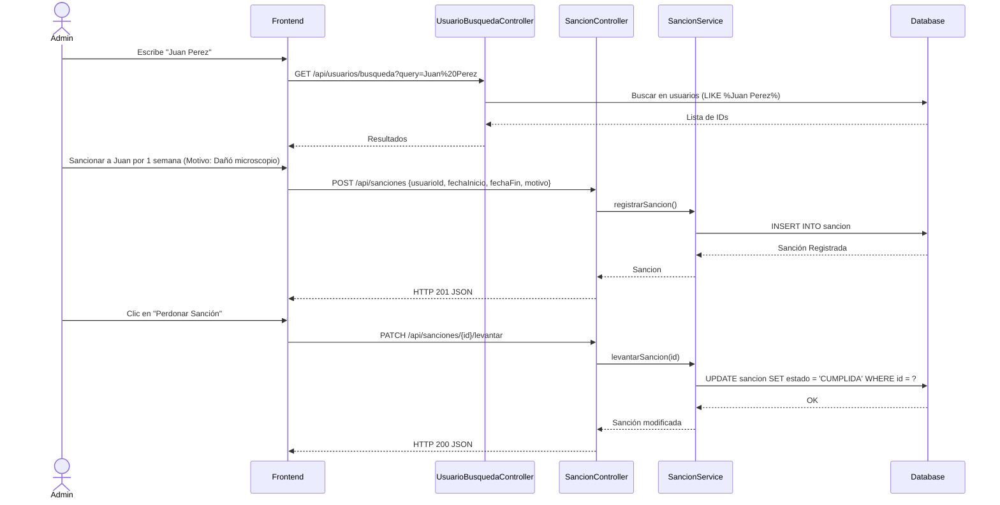

# Servicio de Sanciones (servicio-sanciones)

## Descripción
Este microservicio regula la buena conducta de los usuarios al hacer uso de los ambientes de la universidad. Permite a los administradores aplicar y levantar penalizaciones (sanciones) a docentes o estudiantes por el mal uso de instalaciones (ej. no asistir a una reserva sin cancelar, causar daños). Los usuarios sancionados pierden privilegios en los demás microservicios (como reservar un laboratorio nuevo) mientras su sanción esté activa.

## Arquitectura
- **Frontend:** React (Panel "Gestión de Sanciones" y alertas informativas al usuario sancionado).
- **Backend:** Laravel (`servicio-sanciones`, controlador `SancionController` y utilidades de búsqueda en `UsuarioBusquedaController`).
- **Base de Datos:** MySQL (Tabla: `sancion`, dependencias a la tabla `usuario`).

---

## 1. Función: Verificación de Sanciones (Middleware de Negocio)

### Descripción
Este es el endpoint más consultado por los demás microservicios. Antes de que el `servicio-reserva` permita a un usuario agendar un espacio, se comunica con este servicio para comprobar si el usuario está habilitado o tiene un castigo pendiente.

### Diagrama Mermaid

---

## 2. Función: Imponer y Levantar Sanción (Administrativo)

### Descripción
Un administrador puede buscar usuarios, imponerles una sanción definiendo el motivo y el rango de fechas (Inicio y Fin), o levantar prematuramente una sanción activa si el caso se resuelve por apelación o cumplimiento de servicio.

### Diagrama Mermaid

