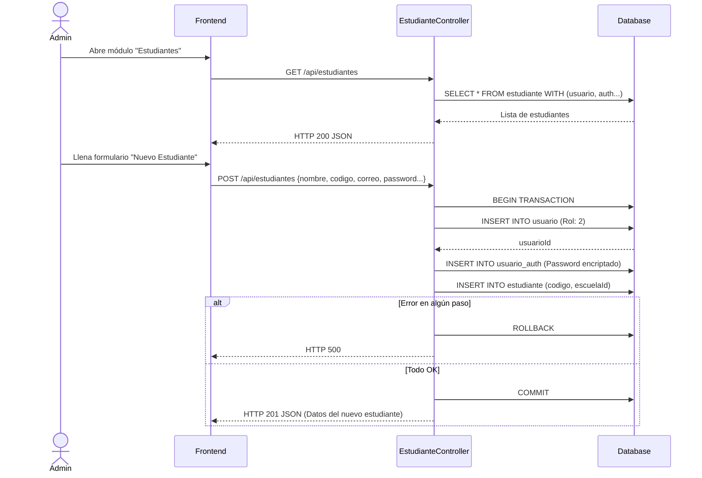
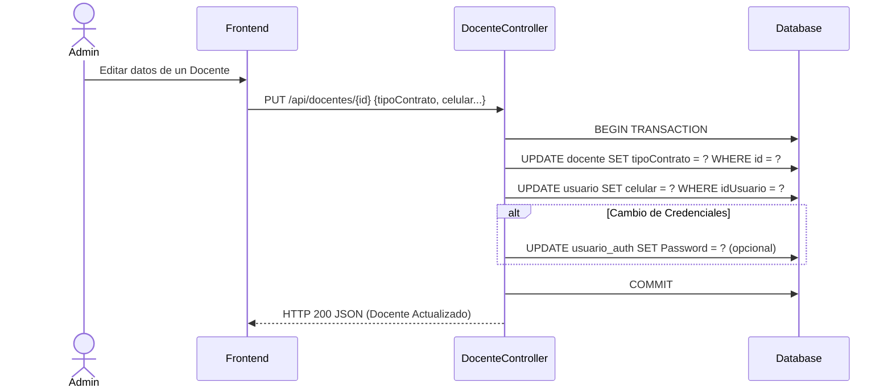
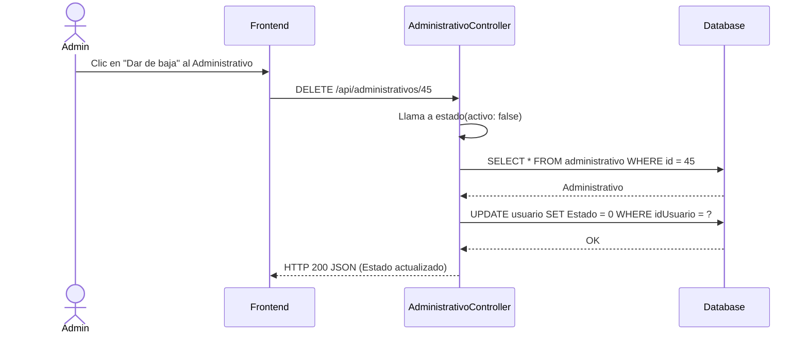

# Servicio de Usuarios (servicio-usuarios)

## Descripción
Este microservicio es responsable de la gestión integral de todos los actores del sistema (Estudiantes, Docentes y Administrativos). Controla el ciclo de vida de los usuarios (CRUD: crear, leer, actualizar, eliminar/desactivar), sus perfiles específicos (código de estudiante, tipo de contrato del docente, etc.) y su relación con la tabla base `usuario` y `usuario_auth` (credenciales).

## Arquitectura
- **Frontend:** React (Pantallas del módulo "Gestión de Usuarios" en el portal de Administrador).
- **Backend:** Laravel (`servicio-usuarios`, controladores `EstudianteController`, `DocenteController`, `AdministrativoController`).
- **Base de Datos:** MySQL (Tablas: `usuario`, `usuario_auth`, `estudiante`, `docente`, `administrativo`).

---

## 1. Función: Gestión de Estudiantes (CRUD)

### Descripción
Permite a la administración visualizar la lista de estudiantes, registrar nuevos (creando simultáneamente su registro en `usuario`, `usuario_auth` y `estudiante`), actualizar su información o darlos de baja (cambiando su estado a inactivo).

### Diagrama Mermaid

---

## 2. Función: Gestión de Docentes (CRUD)

### Descripción
Similar al flujo de estudiantes, pero adaptado a la tabla `docente`, manejando campos específicos como el tipo de contrato, código de docente y especialidad.

### Diagrama Mermaid

---

## 3. Función: Suspensión Lógica de Usuarios (Baja)

### Descripción
El sistema no elimina registros físicamente (Hard Delete) por motivos de auditoría y relaciones con tablas históricas (reservas). En su lugar, se actualiza la bandera `Estado` de la tabla `usuario` a 0 (Inactivo), lo que bloquea el login de dicho usuario.

### Diagrama Mermaid

